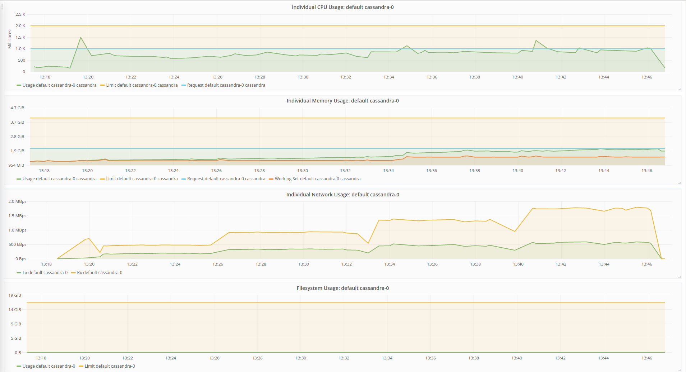
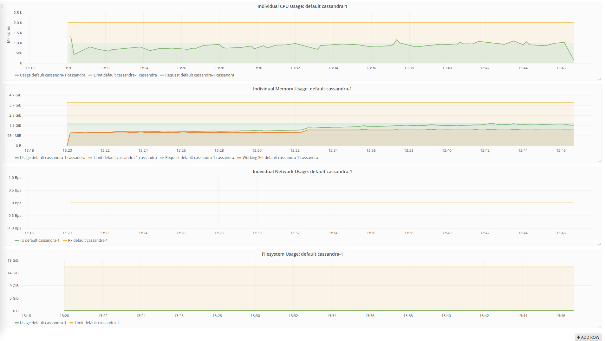
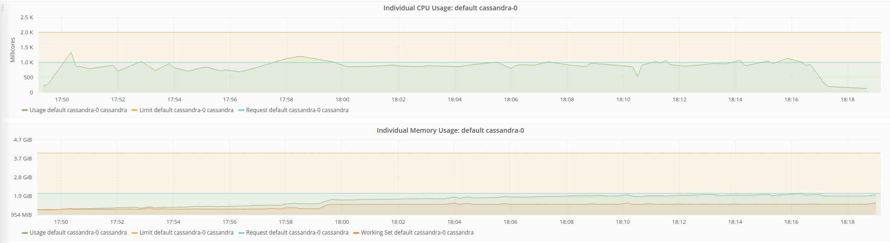
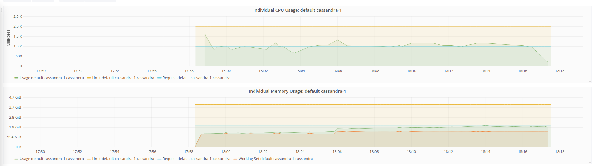
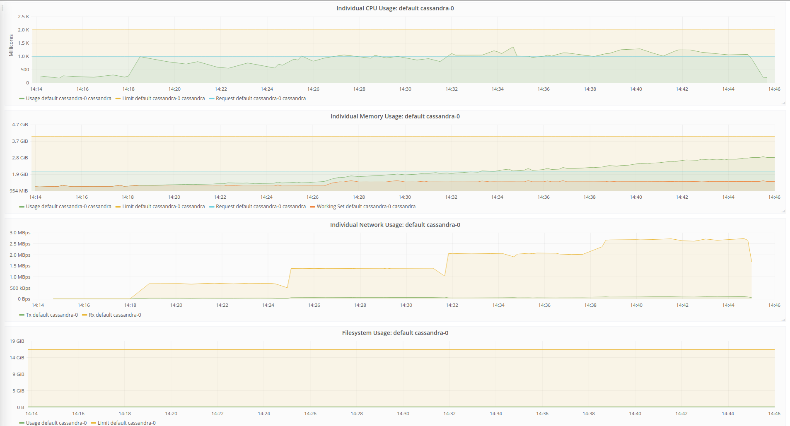
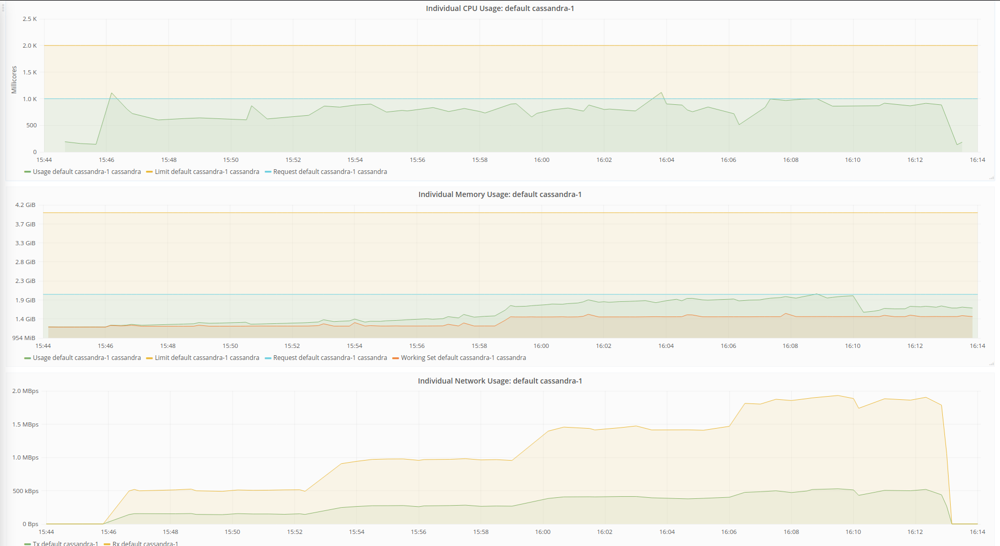
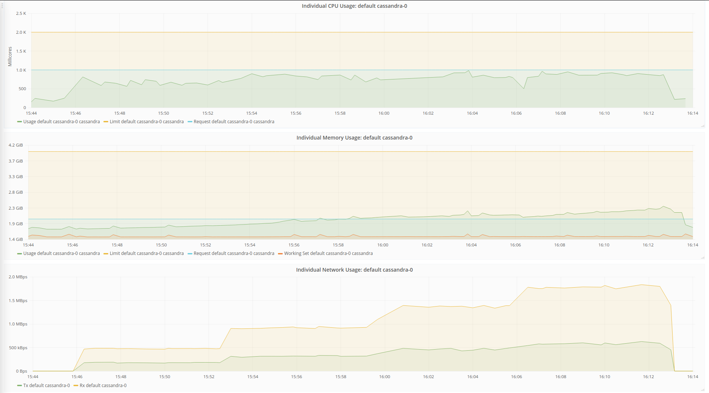

# Capita Selecta Distributed systems

Container with schema create (must be run first): martijns1997/experiment-controller:0.0.2

Container without schema create (must be run afterward): martijns1997/experiment-controller:0.0.1

Tests executed on the local kuberentes cluster:

## HPA

### 1 Clean cassandra database, no data yet present (fully automatic):

Observations:

Right at the start, the CPU usage goes above 100% causing the HPA to scale up the deployment. After this scaling nothing much happens and the resource utilization remains fairly low.

### Adding the HPA soon after the initial spike (to prevent autoscaling too early)

## 2. Manual

### Clean cassandra database 1 node

### Dirty cassandra database 2 nodes (pre-existing data in the database)

After running the experiment with one node, we scaled up the cassandra statefulset with one extra cassandra instance. This caused no spike in memory usage or extra network usage. Note however that due to some weird interaction that the first cassandra instance did flush its memory a few minutes after activation of the second cassandra instance. However this decrease in memory usage does not result in a spike in memory usage in the other cassandra instance, nor in the cpu usage of the instance.

#### Results

 
